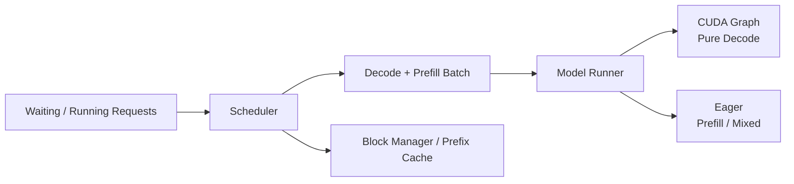

<p align="center">

</p>

# my-nano-vLLM

A compact inference-systems project derived from
[GeeeekExplorer/nano-vLLM](https://github.com/GeeeekExplorer/nano-vllm)
(baseline commit `bb823b3e`), not a from-scratch inference engine and not a
production serving framework.

The project keeps nano-vLLM's small and readable structure while experimenting
with Triton kernels, mixed prefill/decode scheduling, and prefix-cache-aware
scheduling. Changes are integrated only when measurements justify the added
complexity.

## Results

| Change | Baseline | my-nano-vLLM | Measured effect |
|---|---:|---:|---:|
| Mixed scheduling, 1024-token shared budget | ~435 ms max incumbent decode gap | ~58 ms | ~87% lower worst observed decode stall |
| Prefix affinity, 29-block KV-pressure workload | 16,379 executed prefill tokens | 14,319 | 12.6% less prefill work |
| Fused Add+RMSNorm, large prefill rows | compiled PyTorch path | Triton fused kernel | ~1.3× kernel-level speedup (measured large-prefill shapes, RTX 5060 Laptop GPU) |

These are workload-specific measurements, not universal speedups. Mixed
scheduling mainly reduces rare decode stalls under token-budget contention;
prefix affinity becomes useful only when KV allocation pressure can recycle
otherwise reusable cached blocks. The Add+RMSNorm result is kernel-level
(measured large-prefill shapes on the tested RTX 5060 Laptop GPU), not an
end-to-end engine speedup. Details and limits are in `docs/`.

## What changed

### Serving

- Unified decode/prefill scheduling with a shared token budget.
- Chunked prefill while allowing incumbent decode work to continue.
- Bounded prefix-cache-affinity selection with FIFO aging.
- Pure decode retains CUDA Graph replay; mixed batches remain eager.

### GPU kernels

- Triton fused Add+RMSNorm, selectively integrated for large prefill rows.
- Standalone Triton SiLU×Gate and RMSNorm experiments.
- Standalone Triton PagedAttention decode.
- Standalone Triton causal varlen prefill FlashAttention.

### Measurement

- Token-level TTFT and TPOT (P50/P95).
- Prefix-cache lookup/reuse accounting.
- Executed vs scheduled prefill work.
- Contention and KV-cache-pressure workloads.
- Focused decode metadata profiling.

## Evaluated but not integrated

| Change | Status | Why not integrated |
|---|---|---|
| Triton SiLU × Gate | Standalone | No consistent advantage over the compiled baseline. |
| Triton PagedAttention decode | Standalone | Correct, but slower than FlashAttention on the tested RTX 5060 Laptop GPU for most measured batch sizes. |
| Triton prefill FlashAttention | Standalone | Near parity for short sequences, slower than FlashAttention 2 as sequence length grows on the tested GPU. |
| Persistent decode metadata | Not integrated | Profiling and write-path prototypes projected <1% gain for the representative decode-heavy workload. |

## Architecture



## Quick start

```bash
pip install -e .
```

```python
from nanovllm import LLM, SamplingParams

llm = LLM("/path/to/Qwen3-0.6B", enforce_eager=True, tensor_parallel_size=1)
outputs = llm.generate(
    ["Hello, Nano-vLLM."],
    SamplingParams(temperature=0.6, max_tokens=256),
)
print(outputs[0]["text"])
```

The model argument must point to a local Hugging Face model directory
containing config, tokenizer, and weight files. See [`example.py`](example.py)
for a chat-template example.

## Benchmarking

[`bench.py`](bench.py) is an offline harness over the existing
`LLMEngine.step()` loop; it does not add a server or alter scheduling. It has
fixed-seed workloads and writes machine-readable JSON results under
`benchmarks/results/` with synchronized step timing, token-level TTFT/TPOT,
output tokens/s, executed/scheduled prefill tokens, prefix-cache reuse, input
preparation CPU time, and peak allocated GPU memory.

```bash
python3 bench.py --workload balanced --model /path/to/Qwen3-0.6B
python3 bench.py --workload decode-heavy --model /path/to/Qwen3-0.6B
python3 bench.py --workload prefix-sharing --model /path/to/Qwen3-0.6B
```

## Documentation

| Topic | Doc |
|---|---|
| Baseline / benchmark methodology | [`docs/phase1-benchmark.md`](docs/phase1-benchmark.md) |
| Triton fused kernels | [`docs/phase0-baseline.md`](docs/phase0-baseline.md) |
| PagedAttention | [`docs/phase3-paged-attention.md`](docs/phase3-paged-attention.md) |
| Prefill FlashAttention | [`docs/phase4-flash-attention.md`](docs/phase4-flash-attention.md) |
| Mixed scheduling | [`docs/phase5-mixed-scheduling.md`](docs/phase5-mixed-scheduling.md) |
| Prefix-cache affinity | [`docs/phase6-prefix-affinity.md`](docs/phase6-prefix-affinity.md) |
| Persistent decode metadata profiling | [`docs/phase7-persistent-decode-metadata.md`](docs/phase7-persistent-decode-metadata.md) |
| Environment | [`docs/environment.md`](docs/environment.md) |

## Scope

This is a small research/learning inference engine, not a production serving
stack. It intentionally does not implement speculative decoding, quantization,
LoRA, distributed serving, async scheduling, or an HTTP server.

## License and attribution

Derived from [GeeeekExplorer/nano-vLLM](https://github.com/GeeeekExplorer/nano-vllm)
at upstream commit `bb823b3e`. The original MIT license and copyright
attribution are retained in [`LICENSE`](LICENSE).
