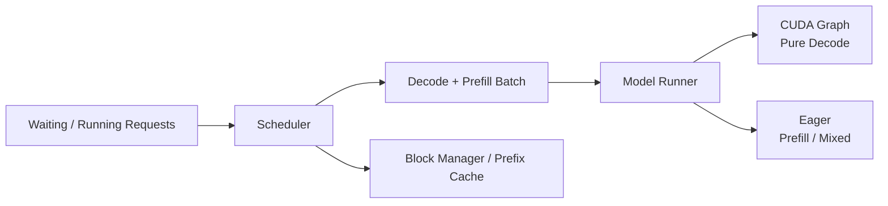

<p align="center">

</p>

# my-nano-vLLM

A compact inference-systems project derived from
[GeeeekExplorer/nano-vLLM](https://github.com/GeeeekExplorer/nano-vllm)
(baseline commit `bb823b3e`), not a from-scratch inference engine and not a
production serving framework.

The project keeps nano-vLLM's small and readable structure while experimenting
with Triton kernels, mixed prefill/decode scheduling, and prefix-cache-aware
scheduling. Changes are integrated only when measurements justify the added
complexity.

## Results

| Improvement | Measured scenario | Baseline → Ours | Result |
|---|---|---|---|
| Mixed scheduling | Max incumbent decode gap, 1024-token shared budget | ~435 ms → ~58 ms | **~87% lower** |
| Prefix affinity | Executed prefill tokens, 29-block KV pressure | 15,957 → 15,427 | **3.3% less work** |
| Fused Add+RMSNorm | Standalone large-prefill microbenchmark | compiled PyTorch → Triton | **~1.3× faster** |

These are workload-specific measurements, not universal speedups. Mixed
scheduling mainly reduces rare decode stalls under token-budget contention;
prefix affinity reduces recomputation only when KV allocation pressure is high
enough to recycle reusable cached blocks (3.3% executed-prefill reduction in
the canonical pressure workload, reproducible via
[`benchmarks/bench_prefix_affinity_pressure.py`](benchmarks/bench_prefix_affinity_pressure.py);
elapsed time did not improve in the recorded run — the result is a compute-work
reduction, not a speedup); the Add+RMSNorm result is a standalone microkernel
result (measured large-prefill shapes on the tested RTX 5060 Laptop GPU) —
process-level A/B runs did not show a clear engine-level benefit, so the Triton
path is not used by the default runtime. Details and limits are in `docs/`.

## What changed

### Serving

- Unified decode/prefill scheduling with a shared token budget.
- Chunked prefill while allowing incumbent decode work to continue.
- Bounded prefix-cache-affinity selection with FIFO aging.
- Pure decode retains CUDA Graph replay; mixed batches remain eager.

### GPU kernels

- Standalone Triton fused Add+RMSNorm (microkernel with correctness and
  performance evaluation; engine-level A/B showed no clear benefit, so the
  default runtime keeps the compiled PyTorch path).
- Standalone Triton SiLU×Gate and RMSNorm experiments.
- Standalone Triton PagedAttention decode.
- Standalone Triton causal varlen prefill FlashAttention.

### Measurement

- Token-level TTFT and TPOT (P50/P95).
- Prefix-cache lookup/reuse accounting.
- Executed vs scheduled prefill work.
- Contention and KV-cache-pressure workloads.
- Focused decode metadata profiling.

## Architecture



## Quick start

Validated environment: Linux/WSL with CUDA 12.8, PyTorch 2.7.0+cu128,
Triton 3.3.1, FlashAttention 2.7.4.post1, Transformers 4.51.3, Qwen3-0.6B.
Install the CUDA/PyTorch/Triton/FlashAttention stack first; see
[`docs/environment.md`](docs/environment.md).

```bash
# after the validated environment above is in place:
pip install -e . --no-deps --no-build-isolation
```

```python
from nanovllm import LLM, SamplingParams

llm = LLM("/path/to/Qwen3-0.6B", enforce_eager=True, tensor_parallel_size=1)
outputs = llm.generate(
    ["Hello, Nano-vLLM."],
    SamplingParams(temperature=0.6, max_tokens=256),
)
print(outputs[0]["text"])
```

The model argument must point to a local Hugging Face model directory
containing config, tokenizer, and weight files. The custom model
implementation is validated on **Qwen3-0.6B**; unsupported Qwen3
configuration features (attention bias, sliding-window attention, RoPE
scaling) fail fast rather than silently producing incorrect outputs. See
[`example.py`](example.py) for a chat-template example.

## Benchmarking

[`bench.py`](bench.py) is an offline harness over the existing
`LLMEngine.step()` loop; it does not add a server or alter scheduling. It has
fixed-seed workloads and writes machine-readable JSON results under
`benchmarks/results/` with synchronized step timing, token-level TTFT/TPOT,
output tokens/s, executed/scheduled prefill tokens, prefix-cache reuse, input
preparation CPU time, and peak allocated GPU memory.

```bash
python3 bench.py --workload balanced --model /path/to/Qwen3-0.6B
python3 bench.py --workload decode-heavy --model /path/to/Qwen3-0.6B
python3 bench.py --workload prefix-sharing --model /path/to/Qwen3-0.6B
```

## Evaluated experiments

| Experiment | Status | Finding |
|---|---|---|
| SiLU × Gate | Standalone | No consistent win over compiled PyTorch |
| PagedAttention decode | Standalone | Slower than FlashAttention 2 for most measured batches |
| Prefill FlashAttention | Standalone | Short-sequence parity; slower at longer lengths |
| Persistent decode metadata | Not integrated | <1% projected gain on representative decode-heavy workload |

Kernel comparisons above refer to the tested RTX 5060 Laptop GPU and measured
configurations; full measurements and methodology are documented under `docs/`.

## Documentation

| Topic | Reference |
|---|---|
| Baseline architecture | [`docs/phase0-baseline.md`](docs/phase0-baseline.md) |
| Benchmark methodology | [`docs/phase1-benchmark.md`](docs/phase1-benchmark.md) |
| Kernel benchmarks | [`benchmarks/bench_kernels.py`](benchmarks/bench_kernels.py) |
| PagedAttention | [`docs/phase3-paged-attention.md`](docs/phase3-paged-attention.md) |
| Prefill FlashAttention | [`docs/phase4-flash-attention.md`](docs/phase4-flash-attention.md) |
| Mixed scheduling | [`docs/phase5-mixed-scheduling.md`](docs/phase5-mixed-scheduling.md) |
| Prefix-cache affinity | [`docs/phase6-prefix-affinity.md`](docs/phase6-prefix-affinity.md) |
| Persistent metadata profiling | [`docs/phase7-persistent-decode-metadata.md`](docs/phase7-persistent-decode-metadata.md) |
| Environment | [`docs/environment.md`](docs/environment.md) |

## Scope

This is a small research/learning inference engine, not a production serving
stack. It intentionally does not implement speculative decoding, quantization,
LoRA, distributed serving, async scheduling, or an HTTP server.

## License and attribution

Derived from [GeeeekExplorer/nano-vLLM](https://github.com/GeeeekExplorer/nano-vllm)
at upstream commit `bb823b3e`. The original MIT license and copyright
attribution are retained in [`LICENSE`](LICENSE).
